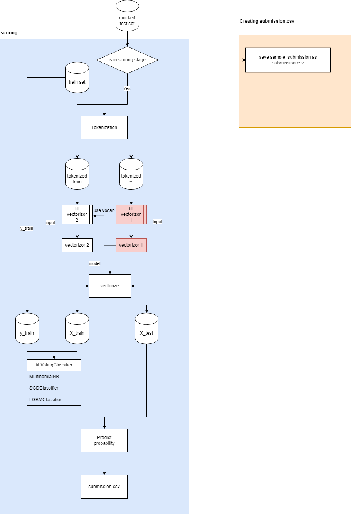

# LLM-Detected

# Installations
- Run ``pip install -r requirements.txt``
- **Remark**: Please update this file if you install any packages

# Datasets
- The datasets can be download through Kaggle websites either by command line ``kaggle competitions download -c llm-detect-ai-generated-text`` or hit Download button on the website
- The extra datasets (DAIGT V2) can be found [here](https://www.kaggle.com/datasets/thedrcat/daigt-v2-train-dataset)
  - The text is generated from various sources such as llama, mistral, chatgpt, falcon, palm, cohere etc.
- All data will be stored in folder ``llm-detected-ai-generated-text``

# Model
- [The baseline model](https://www.kaggle.com/code/batprem/llm-daigt-preprocessing-bypass-catboost-added/notebook)
- 

# Documentation
- Documents your experiments/insights you have tried/found so far here.

## Thang

## Son

## Tanya

## Akrash

# Reference/Useful Link
- [LLM-Detect AI-GP](https://www.kaggle.com/code/donghunlim/newstart-llm-detect-ai-gt-sub): Notebook with score 0.94
	- VotingClassifier (Bagging method)
- [Mistral-7b-v0](https://www.kaggle.com/code/minhsienweng/mistral-7b-v0-detection-train-infer)
	- LLM approach
- [TF-IDF](https://www.kaggle.com/code/murugesann/detect-fake-text-kerasnlp-nm-inf/notebook)
	- Used widely in the competition and among highest scoring
	- [Insights on Key patterns that help in making the distinction](https://www.kaggle.com/competitions/llm-detect-ai-generated-text/discussion/456336)
- Prompting: Generate more data to train (The current dataset is small)
	- [Generate your own data using LLM](https://www.kaggle.com/code/phanisrikanth/generate-synthetic-essays-with-mistral-7b-instruct)
	- [500 more generated](https://www.kaggle.com/competitions/llm-detect-ai-generated-text/discussion/452155)
	- [Even more data](https://www.kaggle.com/competitions/llm-detect-ai-generated-text/discussion/453372)
	- [Even more data](https://www.kaggle.com/datasets/nbroad/daigt-data-llama-70b-and-falcon180b/data)
- [Insights on the competition](https://www.kaggle.com/competitions/llm-detect-ai-generated-text/discussion/457889)